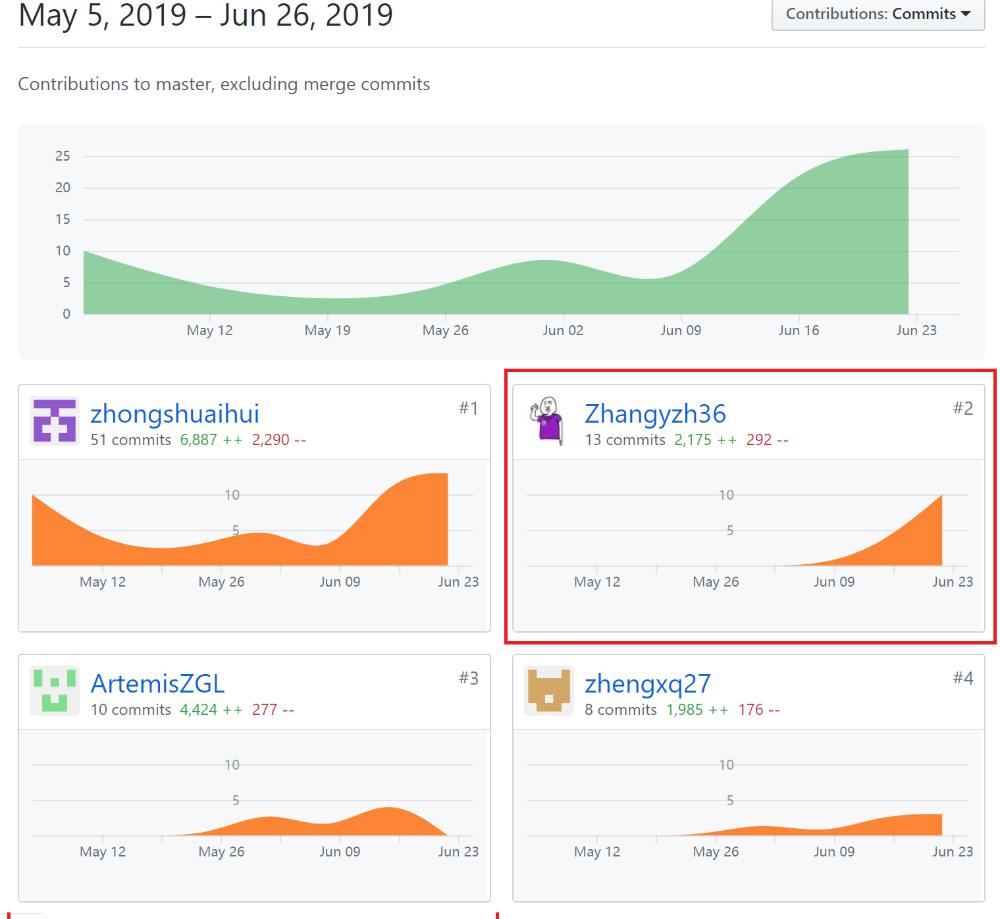
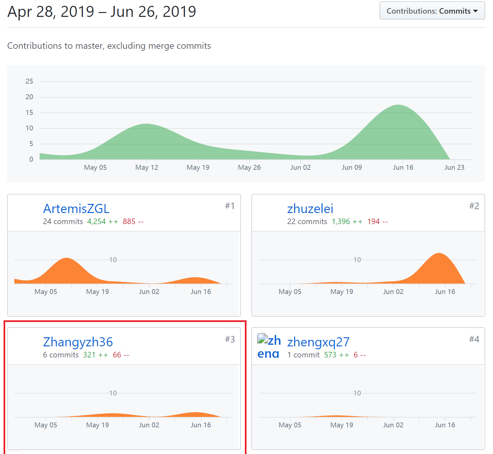

# 16340295张寅哲的Final report #

## 总结 ##
在项目中，我主要管理着后端数据库的工作，包括数据库模型的建立，数据库表的建立，数据库的修改等等；在后台开发中实现了部分API。此外，在前端也完成了一些功能的实现。

## 具体工作 ##

* 小组讨论
  * 参与小组讨论，前期为系统的分析与设计提供自己的意见。包括系统功能，系统流程等。
  * 
* 设计
  * 参与数据库模型的设计与物理数据库的管理。

* 开发
  * 后端完成了与发布任务功能相关的API。
  * 前端展示用户领取与发布的任务的列表；若该任务为问卷，展示发布的问卷的填写情况统计；实现领取问卷的填写功能。

## PSP2.1统计表 ##

| PSP阶段       | 任务    | 耗时（%）  |
| --------   | -----:   | :----: |
|计划||20|
||确定项目范围|10|
||预估工作量和时间|5|
||任务分工|5|
|开发||70|
||分析需求|5|
||生成设计文档|5|
||设计审查|5|
||代码规范|5|
||具体设计|5|
||编码|30|
||代码审查|5|
||测试|10|
|报告||10|
||测试报告|3|
||计算工作量|2|
||事后总结，提出过程改进计划|5|
|合计||100|

## 个人git总结 ##
* 前端

* 后端

## 自认为最得意/或有价值/或又劳苦的工作
* 进行数据库的设计并生生成对应的sql语句，在服务端建立数据库。解决数据库中文编码问题。
* 前端实现填写问卷的功能，实现查看发布的问卷的统计功能。
* 进行测试，设计测试用例，并给出测试报告。

## 个人博客 ##

[张寅哲的博客](zhangyzh_blog.md)
[测试报告](https://gitee.com/zhangyzh36/system_analysis_and_design/tree/%E5%AE%9E%E8%AE%AD%E6%B5%8B%E8%AF%95%E6%8A%A5%E5%91%8A/)
