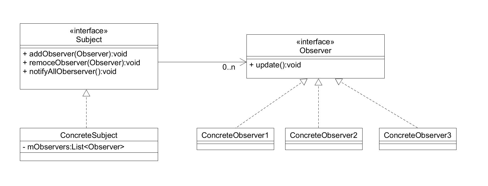

#  浅析观察者模式与RxJava

## 什么是RxJava
  * Github上对于RxJava的介绍
    > RxJava:Reactive Extensions for the JVM – a library for composing asynchronous and event-based programs using observable sequences for the Java VM. 

    它的大概意思是：针对于JVM(Java虚拟机）的响应式扩展实现，一个在Java VM上使用可观察的序列来组合实现异步的、基于事件编程的库。

    RxJava是对于**观察者模式**的扩展，那么观察者模式又是什么呢？
## 什么是观察者模式
  * 观察者模式的不同解释：
    > 观察者模式是将观察者与被观察者分离开，实现了对象间一种一对多的组合关系，当被观察者的状态发生变化时，所有依赖于它的观察者就会检测到变化并且刷新自己的状态。
    
    > 观察者模式定义了一种一对多的依赖关系，让多个观察者对象同时监听某一个主题对象。

    > 观察者模式是关于多个对象想知道一个对象中数据变化情况的一种成熟模式。观察者模式中有一个称作“主题”的对象和若干个称作“观察者”的对象，“主题”和“观察者”之间是一种一对多的依赖关系。

  * 观察者模式中的角色
    * 抽象主题：定义添加和删除观察者的功能；
    * 抽象观察者：定义观察者收到主题通知后要做什么事情；
    * 具体主题：抽象主题的具体实现；
    * 具体观察者：抽象观察者的具体实现。
  * UML类图
    
    

    * Subject接口对应着角色中的抽象主题，它定义了需要实现的接口，包括添加与删除观察者，以及主题发生改变时的动作notifyAllObservers。
    * Observer接口对应着角色中的抽象观察者，它定义了观察者接收到主题发生变化时需要做出的动作update。
    * ConcreteSubject实现了Subject接口，具体了主题。
    * CconcreteObserver1-3具体了观察者，实现了Observer接口。
    

