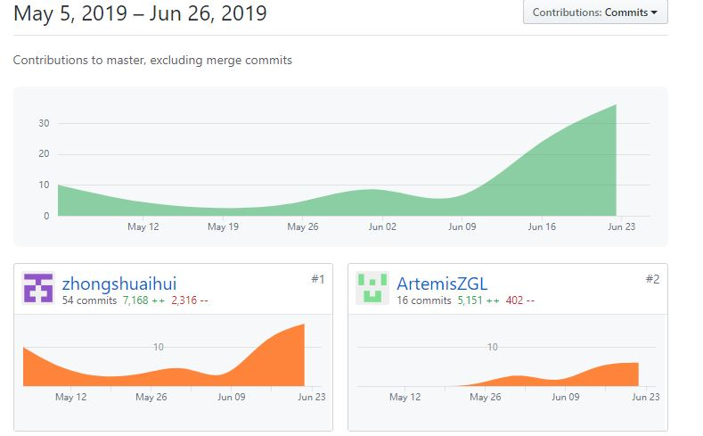

# 16340307 钟朝晖 Final report

## 总结概述

在团队中，除了分配的文档工作外，我主要负责的工作是前端安卓客户端的开发。虽然说我曾经上过安卓开发的课程，但这次大项目的工作量和难度还是超出了我的预期。所幸，在不断学习的过程中，我还是完成了我所的任务，完成了团队分配给我的工作

具体工作如下：

### 设计

- 全程参加会议，并且在项目初期参与了整体项目的实现讨论
- 设计实现了注册登录界面和功能
- 参与文档编写

### 开发

- 设计实现了注册登录的前端页面和逻辑实现
- 实现了MainActivity中三个界面合并的总体框架
- 实现了MainActivity三个界面中Main_fragment的前端页面和逻辑实现

-----
## PSP2.1 统计表

| PSP阶段  |                            | 耗时（%） |
| -------- | -------------------------- | --------- |
| **计划** |                            | **5**     |
|          | 估计任务时间               | 5         |
| **开发** |                            | **90**   |
|          | 分析需求                   | 7        |
|          | 生成设计文档               | 5         |
|          | 设计复审                   | 5         |
|          | 代码规范                   | 5         |
|          | 具体设计                   | 5         |
|          | 具体编码                   | 35        |
|          | 代码复审                   | 8         |
|          | 测试                       | 20        |
| **报告** |                            | **5**     |
|          | 测试报告                   | 1         |
|          | 计算工作量                 | 2         |
|          | 事后总结，提出过程改进计划 | 2        |
| **合计** |                            | **100**   |

----
## 最得意/或有价值/或有苦劳的工作清单

- 最得意：虽然之前写过安卓项目，但这次项目还是第一次参与前后端设计的项目，并且也是第一次实现前端和后端结合。而且这次项目的代码量也是我写过的最大的。无论是从工作量还是从一些对我而言新的技术与模块来说，这次项目都是一个大挑战。

- 最有价值：在项目初期，我是一人进行前端开发，确定了前端的基础功能的页面设计。在整个前端开发过程中，也是竭尽全力，做了我所能做的最大努力。

- 最有苦劳：最累人的部分就是前端初期的UI设计和基础实现。因为这一部分代码量大，并且有很多技术对我而言是新功能，这点可以从我的个人博客里看到。

------

## 个人git总结

### [sysuz4.github.com 文档](https://github.com/sysuz4/sysuz4.github.io/graphs/contributors)

### [EarningMoney 易闲圈前端](https://github.com/sysuz4/EarningMoney/graphs/contributors)

-------
## 个人博客
- [系分项目总结--安卓前端UI一些有用的小技巧](https://blog.csdn.net/Jeffba/article/details/93535916)

---
## 特别致谢

- 郑先淇同学，担任产品经理，为了项目进度和质量尽心尽力
- 朱泽磊同学，全职后台API设计，在与他的对接中迅速完成了前后端连接的工作
- 郑国林同学，前后端双修，创建完后端架构后，在前端进度落后的情况下又来帮助我完成前端开发
- 张寅哲同学，数据库设计主力，在前端进度落后的情况下又来帮助我完成前端开发
- 赵米同学，作为标准的制定和文档的编写人，米哥打在屏幕上的就是我们要遵守的标准