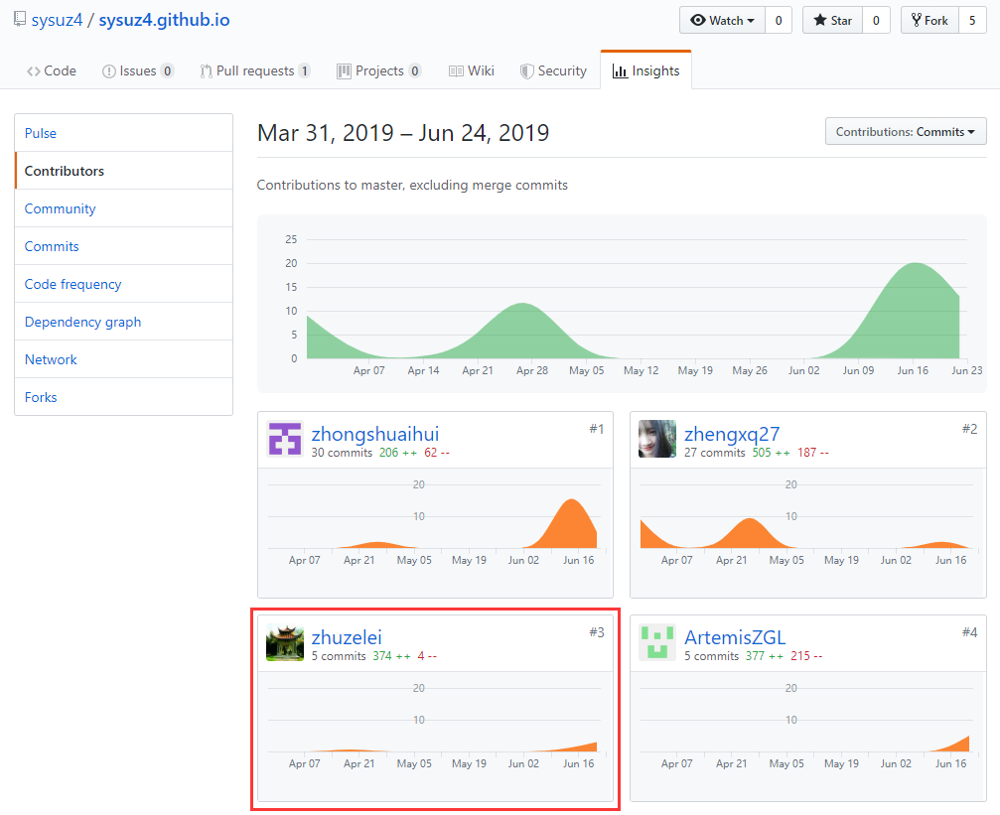
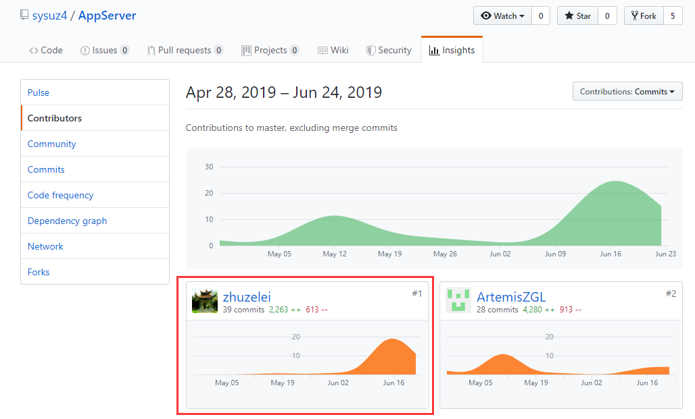

# 16340317 朱泽磊 Final report

## 总结概述

在这个6人的小团队中，除了大家都需要做的画图、写文档、提建议、测试之外，作为本次项目的主力后台开发之一，我个人投入比较多的内容是api的设计实现、后台的搭建和开发工作，同时全程参与api的测试，与产品经理一起画出基本了APP的基本UI设计，为了给枯燥的打码内容增添一点乐趣，我还负责了APP内各个图标的搜集工作。
这次项目的工作量还是挺大的，但是好在我们团队的开发流程和设计模式应该算是比较合理，所以返工的地方较少，没有做太多无用之功。
在这次项目之前，我基本可以说对后台开发是一个小白，但是这次项目后，大致了解了后台的工作模式和前端与后台的交互模式，不敢说是精通，大概算是入了个门吧。

具体工作如下：

### 设计

- 参与调研问卷的设计，提出项目的核心业务和基本逻辑，根据所需要的功能设计后台数据库
- 参与每次例会，针对当前大家面临的问题提出合理的方法，主要是针对后台的数据库设计和用api与前端的交互上
- 考虑清楚APP的基本功能和逻辑后，与产品经理一起进行了UI设计，易闲圈APP初露头角

### 搭建

- 花费巨资购买阿里云服务器三个月
- 在服务器上安装Ubuntu系统，并安装了jdk8，Tomcat8和MySQL等我们需要的工具

### 开发

- 建立完数据库后，将每张表封装成类，实现对每张表的增删改查操作，方便逻辑层调用
- 与前端商量同一api设计后，在逻辑层对每一个api请求进行实现
- api实现完成后，使用postman自行测试，检查数据库中对应的内容是否已更新

-----
## PSP2.1 统计表

| PSP阶段  |                            | 耗时（%） |
| -------- | -------------------------- | --------- |
| **计划** |                            | **5**     |
|          | 估计任务时间               | 5         |
| **开发** |                            | **90**   |
|          | 分析需求                   | 10        |
|          | 生成设计文档               | 5         |
|          | 设计复审                   | 5         |
|          | 代码规范                   | 5         |
|          | 具体设计                   | 5         |
|          | 具体编码                   | 30        |
|          | 代码复审                   | 5         |
|          | 测试                       | 25        |
| **报告** |                            | **5**     |
|          | 测试报告                   | 1         |
|          | 计算工作量                 | 2         |
|          | 事后总结，提出过程改进计划 | 2        |
| **合计** |                            | **115**   |

----
## 最得意/或有价值/或有苦劳的工作清单

- 最得意：从一名完全不了解APP开发和后台开发的小白，学习了大量的后台基础知识，第一次把服务器跑起来，发送的请求收到了服务器对应的消息

- 最有价值：在项目初期，还是有好几位同学一起在做后台的开发，基本框架完成后，他们转战安卓开发，而我基本上一个人担起了后台API的实现部分，顺利地完成了与前端的交互

- 最有苦劳：最累人的部分就是后台开发的代码在自己的理想情况下发送的请求得到的结果正确，但是一旦出现任何健壮性不足的地方，整个服务器都会崩溃，所以在前端各类请求的轰炸下，后台必须不断完善逻辑，保证一个错误的请求无法改变数据库的任何内容，实现最强健壮性！

------

## 个人git总结

### [sysuz4.github.com 文档](https://github.com/sysuz4/sysuz4.github.io/graphs/contributors)

### [APPServer 易闲圈后台](https://github.com/sysuz4/AppServer/graphs/contributors)

-------
## 个人博客
- [后台开发入门](https://blog.csdn.net/weixin_36328380/article/details/88819481)

---
## 特别致谢

- 郑先淇同学，担任产品经理，为了项目进度和质量舌战群儒，是项目一块砖，哪要往哪搬
- 钟朝晖同学，全职安卓开发，解锁“第一个提交代码的人”成就，为APP的燎原之势点燃了星星之火
- 郑国林同学，前后端双修，在迅速搭建完后端毛坯房后移交给我装修，自己又前往前端工地干苦力
- 张寅哲同学，数据库设计主力，留下第一张草图，在最后关头出现拯救安卓端
- 赵米同学，作为标准的制定和文档的编写人，米哥打在屏幕上的就是我们要遵守的标准